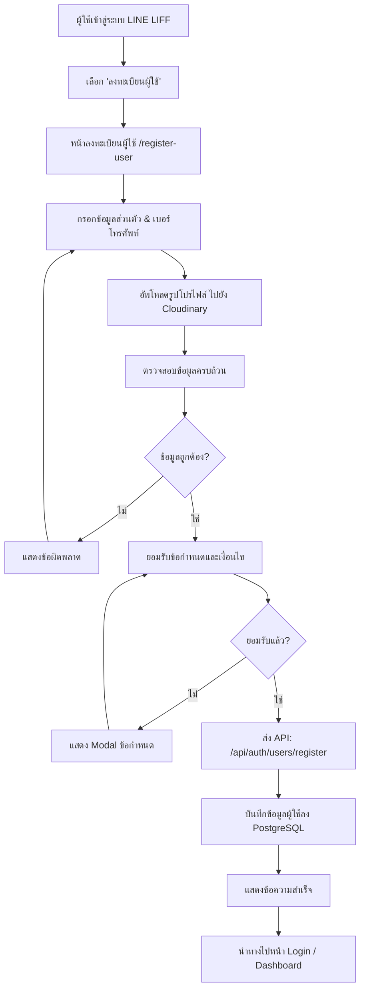
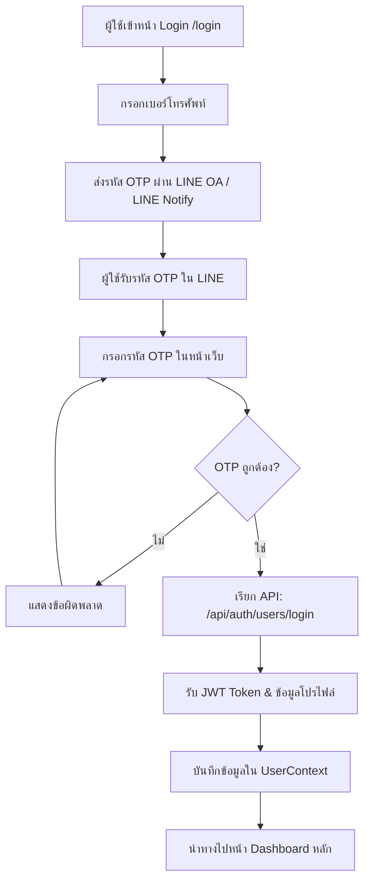
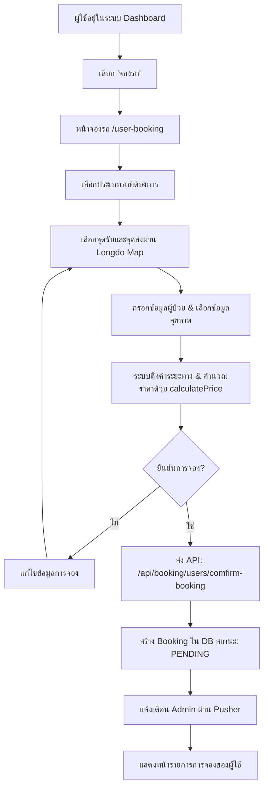
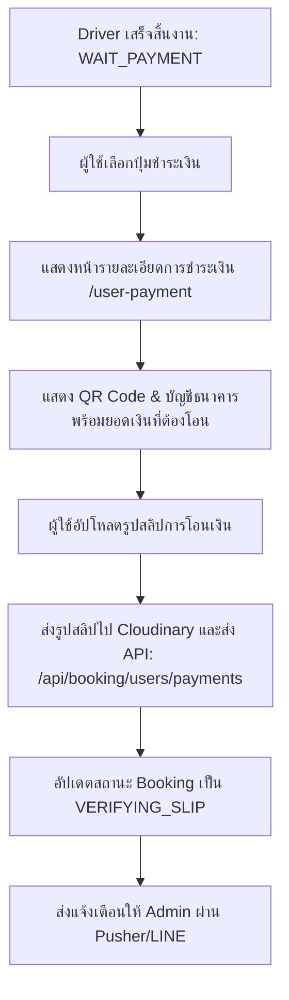
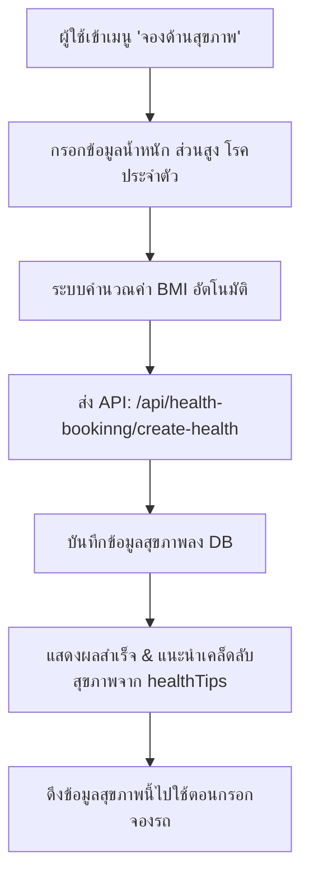
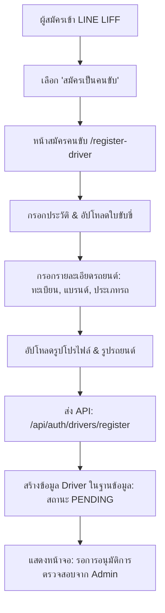
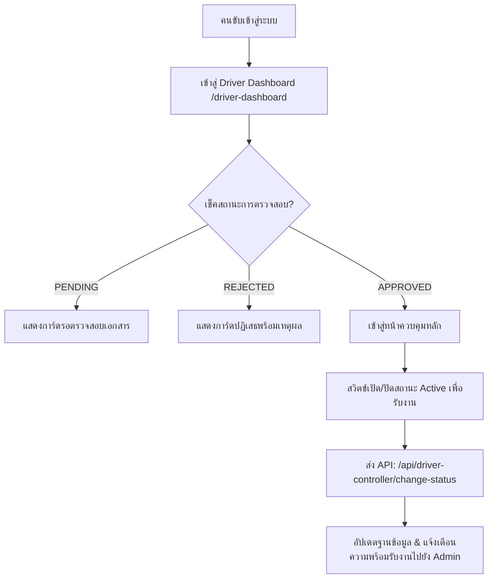
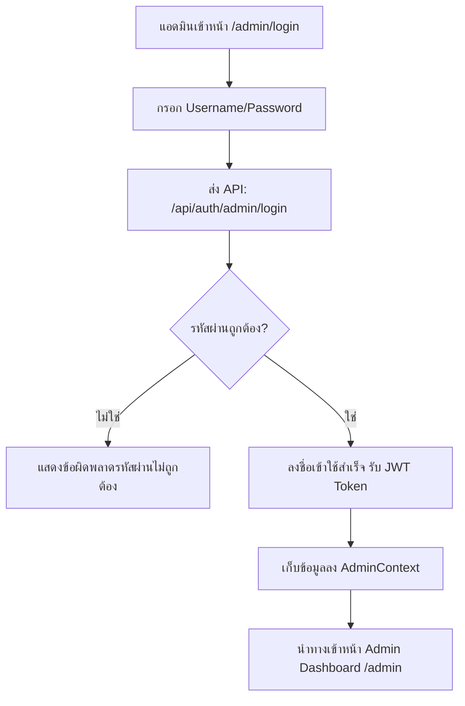
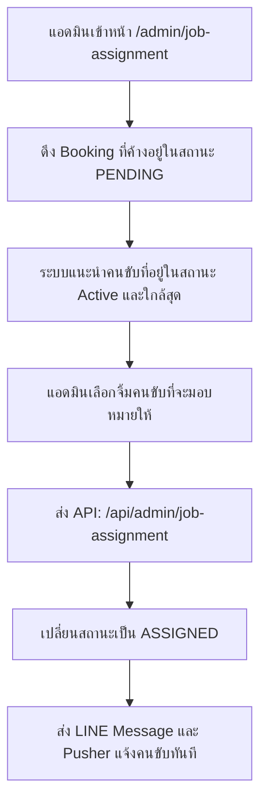

# 📋 DriveCare Full System Specification & Architecture

This document is a unified specification for the **DriveCare** platform, combining the user flows, directory structures, and backend layouts with the full system architectures for **Drivers** and **Admins**.

---

## 🛠️ 1. Technology Stack & Key Integrations

DriveCare is built using a modern, scalable web stack:
- **Core:** Next.js 16 (App Router), React 19, TypeScript, Tailwind CSS 4, DaisyUI
- **Database:** PostgreSQL (via `pg` Pool client in `src/lib/db.ts`)
- **Realtime Notifications:** Pusher (`src/lib/pusher.ts` & `src/store/notification.state.ts`)
- **Maps & Location Services:** Longdo Map API (for geocoding, autocomplete search, route calculation)
- **Authentication:** LINE LIFF Login (User/Driver) + Credentials Login (Admin)
- **External Notifications:** LINE Messaging API (LINE Notify OA messages)
- **Asset Storage:** Cloudinary (for profile pictures and bank transfer slips)

---

## 🔄 2. Complete System Flows (Flowcharts)

### 👤 A. User Workflows

#### 1. User Registration & Onboarding


#### 2. User OTP Login Flow


#### 3. Vehicle Booking & Pricing


#### 4. Payment Slip Upload


#### 5. User Health Profiling


---

### 🚗 B. Driver Workflows

#### 1. Driver Onboarding & Registration


#### 2. Driver Login & Availability Status


#### 3. Driver Job Acceptance & Lifecycle
```mermaid
flowchart TD
    A[Admin มอบหมายงาน หรือ ระบบสุ่ม] --> B[ส่งแจ้งเตือนหา Driver]
    B --> C[Driver ตรวจสอบหน้าประวัติงาน /driver-job]
    C --> D{กดรับงาน (Accept)?}
    D -->|ปฏิเสธ/ไม่ว่าง| E[กรอกเหตุผลปฏิเสธการรับงาน]
    E --> F[ส่ง API: /api/booking/drivers/[id]/cancel-task]
    F --> G[สถานะกลับเป็น UNASSIGNED ให้ Admin มอบใหม่]
    D -->|กดรับงาน| H[ส่ง API: /api/booking/drivers/[id]/accept]
    H --> I[เปลี่ยนสถานะ Booking เป็น ACCEPTED]
    I --> J[ระบบส่ง LINE Alert และอัปเดตผู้ใช้ผ่าน Pusher]
```

#### 4. Driver In-Transit Timeline Controls
```mermaid
flowchart TD
    A[ถึงเวลาเริ่มเดินทาง] --> B[คนขับกด 'เริ่มงาน' (Start Trip)]
    B --> C[ส่ง API: /api/booking/drivers/[id]/start]
    C --> D[สถานะเปลี่ยนเป็น: IN_PROGRESS (On the Way)]
    D --> E[คนขับกดอัพเดทเมื่อถึงจุดรับ ➔ ส่ง API: log-time-line ➔ สถานะ: ARRIVED_PICKUP]
    E --> F[คนขับรับผู้ป่วยขึ้นรถ ➔ ส่ง API: log-time-line ➔ สถานะ: DRIVING]
    F --> G[คนขับส่งผู้ป่วยถึงโรงพยาบาล ➔ ส่ง API: log-time-line ➔ สถานะ: ARRIVED_DESTINATION]
    G --> H[คนขับกดปิดทริป ➔ ส่ง API: /api/booking/drivers/[id]/end]
    H --> I[เปลี่ยนสถานะ Booking เป็น WAIT_PAYMENT รอผู้ใช้ชำระเงิน]
```

---

### 👑 C. Admin Workflows

#### 1. Security Credentials Login


#### 2. Driver Application Verification
```mermaid
flowchart TD
    A[แอดมินตรวจสอบเมนูจัดการผู้สมัครคนขับ] --> B[ดึงข้อมูล: /api/admin/admin-controller/drivers]
    B --> C[แสดงตารางรายการคนขับทั้งหมด]
    C --> D[แอดมินคลิกดูคนขับที่รออนุมัติ /admin/driver/[driverId]]
    D --> E[ตรวจสอบเอกสาร ใบขับขี่ รูปถ่าย และสภาพรถยนต์]
    E --> F{ตัดสินใจอนุมัติ?}
    F -->|อนุมัติ| G[ส่ง API: /api/admin/admin-controller/update (status: approved)]
    G --> H[ระบบอัปเดตสถานะเป็นพร้อมขับรถ]
    F -->|ปฏิเสธ| I[กรอกเหตุผลปฏิเสธการลงทะเบียน]
    I --> J[ส่ง API: /api/admin/admin-controller/update (status: rejected)]
```

#### 3. Booking Dispatch & Job Assignment


#### 4. Bank Transfer Slip Verification
```mermaid
flowchart TD
    A[แอดมินเข้าหน้าตรวจสอบสลิป /admin/verified-slip] --> B[แสดงตารางรายการที่จ่ายเงินแล้วรอเช็คสลิป]
    B --> C[คลิกดูรูปสลิปโอนเงิน & ข้อมูลธุรกรรม]
    C --> D{ข้อมูลสลิปถูกต้อง?}
    D -->|ไม่ถูกต้อง| E[กรอกเหตุผลปฏิเสธสลิปโอนเงิน]
    E --> F[ส่ง API: /api/booking/admin/[id]/handle-slip (status: reject)]
    F --> G[สถานะเป็น PAY_FAILED แจ้งผู้ใช้ให้อัปโหลดใหม่]
    D -->|ถูกต้อง| H[ส่ง API: /api/booking/admin/[id]/handle-slip (status: approve)]
    H --> I[อัปเดตสถานะ Booking เป็น SUCCESS]
    I --> J[ระบบส่งสลิปอนุมัติ & ใบรับเงินให้ผู้ใช้ทาง LINE]
```

---

## 📂 3. Complete Directory Structure

Below is the directory mapping for all components, routes, styles, helpers, and files within the codebase:

### 🏠 Pages & Routing (`src/app/`)
```
src/app/
├── (app)/                              # Authenticated Layout (User & Driver Screens)
│   ├── edit-profile-driver/
│   │   └── page.tsx                    # หน้าแก้ไขโปรไฟล์ของฝั่งคนขับ
│   ├── edit-profile-user/
│   │   └── page.tsx                    # หน้าแก้ไขโปรไฟล์ของฝั่งผู้ใช้ทั่วไป
│   ├── driver-dashboard/
│   │   └── page.tsx                    # หน้าแรกของคนขับ (เปิดรับงาน, สรุปประวัติ)
│   ├── driver-job/
│   │   └── page.tsx                    # หน้าการทำงานของคนขับ (งานรออยู่, งานประวัติ)
│   ├── health-user-booking/
│   │   └── page.tsx                    # หน้าประเมินข้อมูลสุขภาพและวัดค่า BMI
│   ├── job-detail/
│   │   └── [id]/
│   │       └── page.tsx                # หน้ารายละเอียดงานคนขับพร้อมปุ่มอัปเดตไทม์ไลน์
│   ├── job-detail-user/
│   │   └── page.tsx                    # หน้าสถานะติดตามทริปการเดินทางแบบสดของผู้ป่วย
│   ├── notifications/
│   │   └── page.tsx                    # หน้าการแจ้งเตือนของผู้ใช้ทั่วไป
│   ├── settings/
│   │   └── page.tsx                    # หน้าตั้งค่า ออกจากระบบ ลิงค์ LINE Notify
│   ├── user-booking/
│   │   └── page.tsx                    # หน้าจองการเดินทางหลักของผู้ใช้
│   ├── user-list-reserve/
│   │   └── page.tsx                    # หน้าดูรายการประวัติและคิวการจองของผู้ใช้
│   ├── user-payment/
│   │   └── page.tsx                    # หน้าหลักการชำระเงินโอน และอัปโหลดสลิป
│   ├── layout.tsx                      # Layout และ Sidebar เมนูด้านข้างสำหรับ user/driver
│   └── page.tsx                        # หน้าแรกหลังเข้าระบบ (Dashboard / Redirect Router)
│
├── admin/                              # Admin Console Pages (Credentials Auth)
│   ├── driver/
│   │   └── [driverId]/
│   │       └── page.tsx                # หน้าจอแอดมินดูรายละเอียดผู้สมัครคนขับเพื่อตรวจสอบ
│   ├── job-assignment/
│   │   └── page.tsx                    # หน้าสำหรับแอดมินคอยกดแจกงานค้างให้คนขับ
│   ├── login/
│   │   └── page.tsx                    # หน้าล็อคอินแอดมินโดยใช้ Username/Password
│   ├── manager-users/
│   │   └── page.tsx                    # หน้าจอตารางจัดการลบแก้ไขผู้ใช้และคนขับทั้งหมด
│   ├── overview-booking/
│   │   └── page.tsx                    # หน้า Dashboard คุมรายการจองทั่วทั้งระบบ
│   ├── report/
│   │   └── page.tsx                    # หน้ารายการคำร้องแจ้งปัญหาที่ผู้ใช้ส่งมาเคลม
│   ├── verified-slip/
│   │   └── page.tsx                    # หน้ารายการเช็คสลิปธนาคารโอนชำระค่าบริการ
│   ├── layout.tsx                      # Layout และแถบเมนูข้างแอดมิน (AdminSidebar)
│   └── page.tsx                        # หน้าแรกแอดมิน: สรุปสถิติ รายรับ และกราฟการเงิน
│
├── login/
│   └── page.tsx                        # ประตูเข้าสู่ระบบด้วย LINE Login (LINE LIFF)
├── register-user/
│   └── page.tsx                        # หน้ากรอกลงทะเบียนข้อมูลส่วนตัวผู้ป่วยใหม่
├── register-driver/
│   └── page.tsx                        # หน้ากรอกลงทะเบียนสำหรับคนสมัครขับรถและรถยนต์
├── layout.tsx                          # Layout สูงสุดของระบบ จัดการ HTML5, Head, Fonts
└── globals.css                         # CSS สไตล์หลักของโครงการ รวม Tailwind & Theme
```

### 📡 API Endpoints Route Handlers (`src/app/api/`)
```
src/app/api/
├── auth/
│   ├── admin/login/                    # [POST] ล็อกอินแอดมินด้วย Password
│   ├── drivers/register/               # [POST] สมัครคนขับลงฐานข้อมูล (pending_verify)
│   └── users/
│       ├── login/                      # [POST] ล็อกอินผู้ใช้ผ่านข้อมูล LINE
│       └── register/                   # [POST] ลงทะเบียนผู้ใช้ทั่วไปใหม่
│
├── admin/
│   ├── admin-controller/
│   │   ├── delete/                     # [DELETE] ลบโปรไฟล์สมาชิก (user หรือ driver)
│   │   ├── drivers/                    # [GET] ดึงรายชื่อคนขับทั้งหมดที่รอการตรวจสอบ
│   │   ├── fetch-driver/               # [GET] ดึงข้อมูลดิบคนขับเฉพาะบุคคล
│   │   ├── fetch-user/                 # [GET] ดึงข้อมูลดิบผู้ใช้เฉพาะบุคคล
│   │   └── update/                     # [PATCH] แก้ไขสิทธิหรืออนุมัติคนขับ (approve/reject)
│   ├── dashboard/                      # [GET] ดึงสถิติรายรับ สัดส่วนงาน และจำนวนผู้ใช้
│   ├── job-assignment/                  # [GET/POST] เรียกคิวงานค้าง และบันทึกจัดส่งงานให้คนขับ
│   ├── logout/                         # [POST] เคลียร์ Session แอดมิน
│   └── me/                             # [GET] ข้อมูลยืนยันความถูกต้อง JWT แอดมิน
│
├── user-controller/
│   ├── edit-profile/                   # [PATCH] ผู้ใช้อัปเดตข้อมูลรายละเอียดโปรไฟล์ตนเอง
│   └── upload-image/                   # [POST] อัปโหลดรูปภาพใบหน้าผู้ใช้ไปที่ Cloudinary
│
├── driver-controller/
│   ├── change-status/                  # [PATCH] คนขับเปลี่ยนการพร้อมรับงาน (active/inactive)
│   ├── driver-logout/                  # [POST] เคลียร์โทเค็นคนขับ
│   ├── edit-profile/                   # [PATCH] คนขับแก้ไขข้อมูลส่วนตัวหรือข้อมูลรถยนต์
│   └── upload-image/                   # [POST] คนขับอัปโหลดรูปรถหรือรูปใบขับขี่
│
├── booking/
│   ├── admin/
│   │   ├── [id]/handle-slip/           # [POST] อนุมัติ/ปฏิเสธสลิปโอนเงิน
│   │   ├── bookings/                   # [GET] เรียกดูรายการจองทั้งหมดในระบบ
│   │   ├── get-bookings/               # [GET] ตารางงานพร้อมตัวกรองสถานะต่างๆ
│   │   └── get-slip/                   # [GET] ตรวจสอบรูปสลิปจากเลขการจอง
│   ├── drivers/
│   │   ├── [id]/
│   │   │   ├── accept/                 # [POST] คนขับกดรับงานนี้ไปปฏิบัติการ
│   │   │   ├── cancel-task/            # [POST] คนขับกดยกเลิกสละสิทธิ์งานรับที่ได้มา
│   │   │   ├── end/                    # [POST] คนขับส่งผู้ป่วยเรียบร้อย จบทริป
│   │   │   ├── finish/                 # [POST] ปิดจ็อบสุดท้าย
│   │   │   ├── log-time-line/          # [POST] คนขับอัปเดตสเตตัสการเดินทางย่อย (ถึงจุดรับ, บนรถ)
│   │   │   └── start/                  # [POST] คนขับเริ่มเดินทางออกจากจุดจอด
│   │   ├── my-job/                     # [GET] รายงานลิสต์คิวงานทั้งหมดของคนขับที่เข้าสู่ระบบ
│   │   └── my-job-detail/              # [GET] รายละเอียดลึกๆ ในงานเพื่อดึงเส้นทางขับรถ
│   └── users/
│       ├── [id]/
│       │   ├── cancel-booking/         # [POST] ผู้ป่วยกดยกเลิกจอง
│       │   └── detail-booking/         # [GET] หน้ารายละเอียดทริปปัจจุบัน
│       ├── comfirm-booking/            # [POST] ผู้ป่วยกดยืนยันบันทึกคิวจอง
│       ├── my-bookings/                # [GET] ดึงประวัติการเดินทางทั้งหมดของตนเอง
│       └── payments/                   # [POST] ผู้ป่วยอัปโหลดสลิปที่จ่ายเงินเรียบร้อย
│
├── health-bookinng/
│   ├── create-health/                  # [POST] บันทึกข้อมูลสุขภาพ น้ำหนัก ส่วนสูง
│   └── get-health/                     # [GET] ดึงข้อมูลประวัติสุขภาพย้อนหลัง
│
├── reports/
│   ├── admin/                          # [GET/POST] แอดมินเรียกประเด็นแจ้งปัญหา & บันทึกคำตอบ
│   ├── drivers/                        # [POST] คนขับแจ้งปัญหาฉุกเฉินระหว่างทริป
│   └── users/                          # [POST] ผู้ป่วยร้องเรียนปัญหาการรับส่ง
│
├── line/                               # ระบบแจ้งเตือนทาง LINE SDK Webhook
└── pusher/                             # [POST] ให้บริการออกบัตรสิทธิ์สำหรับ Client Pusher
```

### 🎨 UI Components Directory (`src/components/`)
```
src/components/
├── user/
│   └── StatusTrackerCard.tsx            # การ์ดแสดงไทม์ไลน์ 5 จุด สำหรับผู้ป่วยติดตามสถานะรถแบบสดๆ
│
├── driver/
│   ├── cards/
│   │   ├── JobCard.tsx                 # การ์ดแสดงสรุปงาน ขนาดกะทัดรัด
│   │   ├── JobPassengerCard.tsx        # ข้อมูลผู้ป่วยและข้อมูลสุขภาพสำหรับคนขับดู
│   │   └── JobScheduleRouteCard.tsx    # การ์ดแสดงสถานที่ เวลา และเส้นทางงาน
│   ├── dashboard/
│   │   ├── DriverDashboardApproved.tsx # แดชบอร์ดคนขับที่ได้รับอนุมัติแล้ว (สลับสถานะ, รับงานใหม่)
│   │   ├── DriverPendingApprovalNotice.tsx # กล่องประกาศเตือน รอแอดมินอนุมัติสิทธิ
│   │   └── DriverRejectedNotice.tsx    # กล่องประกาศบอกว่า แอดมินปฏิเสธการลงทะเบียน
│   ├── driver-job/
│   │   ├── EmptyState.tsx              # หน้าสเตตัสเปล่า ไม่มีรายการงานรับ
│   │   ├── InProgressLayout.tsx        # รายการสกรีนคนขับ สำหรับงานที่กำลังรับส่งอยู่ ณ ปัจจุบัน
│   │   └── UpcomingLayout.tsx          # รายการสกรีนคนขับ สำหรับงานที่จองล่วงหน้าเข้ามา
│   ├── job-detail/
│   │   ├── CompletedLayout/            # หน้าจอแสดงสรุปรายละเอียดงานที่ทำเสร็จแล้ว
│   │   ├── InProgressLayout/           # หน้าจอคนขับอัปเดตปุ่มเส้นทาง เดินรถระหว่างงาน
│   │   ├── jobStatus/
│   │   │   ├── ConfirmStatusModal.tsx  # ป๊อปอัปให้คนขับกดยืนยันขั้นตอน
│   │   │   ├── JobStatusCard.tsx       # การ์ดความคืบหน้าสรุปของทริป
│   │   │   ├── StatusActions.tsx       # ปุ่มสำหรับกดอัปเดตไปสเต็ปถัดไป
│   │   │   └── StatusProgress.tsx      # บาร์สเกลคืบหน้าการทำงาน
│   │   └── timeline/
│   │       └── Timeline.tsx            # เส้นแกนประวัติการบันทึกเวลาจริงที่รถเดินผ่านจุดสำคัญ
│   └── map/
│       └── DriverMapWithActions.tsx    # แผนที่ Longdo วาดพิกัดจุดรับส่งและรถยนต์ของคนขับ
│
├── admin/
│   ├── dashboard/
│   │   ├── DashboardHeaderAdmin.tsx    # แถบสถิติตัวเลขรายรับ งานเสร็จ งานยกเลิก เมตริกหลัก
│   │   ├── MetricCard.tsx              # การ์ดนำเสนอเมตริกแต่ละแบบ
│   │   ├── ReportAnalyticsCard.tsx     # การ์ดแสดงสถิติประเด็นแจ้งปัญหาจากคนรับบริการ
│   │   ├── SimpleLineChart.tsx         # กราฟเส้นแนวโน้มรายได้และจำนวนทริปรายวัน
│   │   └── DonutCard.tsx               # กราฟวงกลมแสดงสัดส่วนประเภทรถและงาน
│   ├── job-assignment/
│   │   ├── AssignDriverModal.tsx       # หน้าต่างป๊อปอัปรายชื่อคนขับพร้อมพิกัด สำหรับกดมอบงาน
│   │   ├── JobAssignmentMobileCards.tsx# การ์ดคิวงานฉบับพกพาสำหรับดูในสมาร์ทโฟน
│   │   └── JobAssignmentTable.tsx      # ตารางหลักสำหรับเลือกคู่จองรถกับคนขับ
│   ├── manager-users/
│   │   ├── AddressModal.tsx            # แสดงที่อยู่ของพิกัดสมาชิกในรูปแบบป๊อปอัป
│   │   ├── AdminUsersTable.tsx         # ตารางรายชื่อผู้ใช้ ค้นหา คัดกรอง และลบแก้ไขได้
│   │   ├── Avatar.tsx                  # รูปโปรไฟล์ผู้ใช้พร้อมการจัดการ fallback รูปว่าง
│   │   ├── ConfirmDeleteModal.tsx      # ป๊อปอัปยืนยันก่อนลบแอคเคาท์จริงออกจากระบบ
│   │   ├── EditUserModal.tsx           # ฟอร์มแก้ไขรายละเอียดส่วนตัว สิทธิ์การใช้งาน
│   │   ├── FilterSelect.tsx            # ปุ่มเลือกฟิลเตอร์คัดประเภท
│   │   ├── GroupToggle.tsx             # สวิตช์สลับดูระหว่าง "ผู้ป่วย" และ "คนขับ"
│   │   └── StatusBadge.tsx             # ป้ายบอกสถานะการตรวจสอบเอกสารสีสันชัดเจน
│   ├── overview-booking/
│   │   ├── BookingManageModal.tsx      # โมดอลตัวยับยั้ง จัดการแก้ไขสถานะ ยกเลิก ทับสถานะได้อิสระ
│   │   └── BookingOverviewTable.tsx    # ตารางหลักแสดงประวัติรวมจองพร้อมรหัสทริปทั้งหมด
│   ├── report/
│   │   ├── ReportTable.tsx             # ตารางรับเรื่องปัญหาของสมาชิกที่ส่งเข้ามา
│   │   ├── ReportTypeDropdown.tsx      # ฟิลเตอร์แยกประเภทปัญหา (ฉุกเฉิน, รถช้า, อื่นๆ)
│   │   └── modal-assignmemt-accept.tsx # กล่องโต้ตอบการชี้ข้อสรุปคดี
│   ├── verified-slip/
│   │   ├── PaymentSlipModal.tsx        # หน้าต่างตรวจสอบสลิปโอนเงินจริงจากธนาคาร
│   │   ├── RejectPaymentModal.tsx      # ป๊อปอัปเลือกสาเหตุตอนปฏิเสธการโอนเงิน
│   │   └── VerifiedSlipTable.tsx       # ตารางจัดสเตตัสการชำระเงินโอนรอการตรวจสอบ
│   ├── AdminPageHeader.tsx             # หัวแถบด้านบนของ Dashboard บอกข้อมูลแอดมินปัจจุบัน
│   ├── AdminRouteLoader.tsx            # ตัวดักจับและโหลดหน้าเพื่อป้องกันคนไร้สิทธิเข้าถึง
│   ├── AdminSidebar.tsx                # แถบเมนูด้านซ้ายหลัก นำทางไปส่วนควบคุมต่างๆ
│   └── ReplyReportModal.tsx            # ป๊อปอัปตอบกลับการแจ้งความคืบหน้าให้ผู้ร้องเรียน
│
├── navigation-menu/
│   ├── nav-menu.ts                     # ไฟล์คอนฟิกตัวเลือกไอคอนและลิงก์ของเมนู (User/Driver แยกกัน)
│   └── bottom-navbar.tsx               # แท็บเมนูด้านล่างบนมือถือสำหรับฝั่งผู้ใช้งานทั่วไป
│
├── modals/
│   ├── LineNotifyModal.tsx             # หน้าต่างขอเชื่อมแจ้งเตือน Line Notify Token
│   ├── PolicyModal.tsx                 # เอกสารเงื่อนไขทางข้อกฎหมายข้อมูลส่วนตัว (PDPA)
│   ├── ReportModal.tsx                 # ฟอร์มป๊อปอัปสำหรับผู้ใช้กดร้องเรียนระหว่างทริป
│   └── UpslipModal.tsx                 # กล่องอัปโหลดภาพใบเสร็จชำระค่าบริการ
│
└── common/
    ├── Button.tsx                      # ปุ่มกลางของระบบ ออกแบบรองรับการโหลด
    ├── SelectDropdown.tsx              # เมนูตัวเลือก Dropdown ทั่วไป
    └── ConsentCheckbox.tsx             # เช็คบ็อกซ์ยินยอมเงื่อนไขการใช้งาน
```

### 🔄 React Context & Stores
- **`src/context/UserContext.tsx`:** เก็บโทเค็น JWT ข้อมูลโปรไฟล์ผู้ใช้งานและคนขับ คอยตรวจสอบสิทธิ์ LINE LIFF
- **`src/context/AdminContext.tsx`:** คุมสถานะ ล็อกอิน และยืนยันความถูกต้องความปลอดภัยของฝั่งแอดมินทั้งหมด
- **`src/store/notification.state.ts`:** คุมสถานะ Global ด้านการสะสมกระดิ่งแจ้งเตือนและระบบเรียลไทม์ Pusher

### 🩺 TypeScript Types (`src/types/`)
- **`src/types/profile/`:** โครงสร้างข้อมูลพื้นฐาน, โปรไฟล์ฝั่งคนไข้ (`user.ts`), และคนขับ (`driver.ts`)
- **`src/types/user/`:** รูปแบบตัวแปรของการจองรถ (`bookings.ts`) และแบบประเมินสุขภาพ (`health-bookinng.ts`)
- **`src/types/driver/`:** ประวัติแดชบอร์ดการรับงาน (`dashboard.ts`), เส้นทางจีพีเอส (`route.ts`), และเหตุการณ์ในทริป (`timeline.ts`)
- **`src/types/admin/`:** โครงสร้างสำหรับหน้าระบบแอดมิน เช่น ข้อมูลตารางจอง (`booking-overview.ts`), สลิปการชำระเงิน (`bookingSlip.ts`), แดชบอร์ดรวมสถิติ (`dashboard.ts`), การแจกจ่ายคิวงาน (`job-assignment.ts`), การคุมแผงแจ้งเรื่องร้องเรียน (`report.ts`)

---

## 🗃️ 4. External Integrations Matrix

### 1. Database PostgreSQL Tables (Conceptual Schema)
Based on DB query helper `src/lib/db.ts`, the database coordinates these tables:
- **`users`:** `id`, `name`, `tel`, `profile_image`, `line_user_id`, `created_at`, etc.
- **`drivers`:** `id`, `name`, `tel`, `license_plate`, `vehicle_brand`, `vehicle_type`, `driver_license_url`, `status` (`pending`/`approved`/`rejected`), `is_active` (`true`/`false`), `lat`, `lng`.
- **`bookings`:** `id`, `user_id`, `driver_id`, `pickup_name`, `pickup_lat`, `pickup_lng`, `dropoff_name`, `dropoff_lat`, `dropoff_lng`, `price`, `status` (`pending`, `assigned`, `accepted`, `in_progress`, `arrived_pickup`, `driving`, `arrived_destination`, `wait_payment`, `verifying_slip`, `success`, `pay_failed`, `cancelled`), `scheduled_at`, `car_type_id`, `patient_name`, `patient_tel`, `slip_image_url`, `created_at`.
- **`health_records`:** `id`, `user_id`, `weight`, `height`, `bmi`, `blood_type`, `congenital_disease`, `allergy`, `created_at`.
- **`reports`:** `id`, `booking_id`, `reporter_id`, `reporter_role`, `topic`, `detail`, `reply_message`, `status` (`pending`/`resolved`), `created_at`.

### 2. Pusher Channels & Events Matrix
| Role / Event Trigger | Pusher Channel | Event Name | Payload |
|---|---|---|---|
| **Driver location update** | `presence-booking-[bookingId]` | `client-location-update` | `{ lat: number, lng: number }` |
| **Trip status updated** | `private-user-[userId]` | `booking-status-updated` | `{ bookingId, status, timeline }` |
| **New booking created** | `private-admin` | `new-booking-created` | `{ bookingId, user_name }` |
| **Slip uploaded** | `private-admin` | `slip-uploaded` | `{ bookingId, user_name }` |
| **New report/issue** | `private-admin` | `new-report-created` | `{ reportId, topic }` |

### 3. LINE Notify Notifications Templates (`src/services/sent-line-user/`)
- **`success-reserved.ts`:** แจ้งเตือนลูกค้าว่าบันทึกจองเรียบร้อย
- **`driver-accepted.ts`:** แจ้งรายละเอียดคนขับรถ ชื่อ เบอร์โทร เลขทะเบียนรถ ไปหาผู้จอง
- **`status-update.ts`:** ส่งแจ้งสถานะย่อย (รถกำลังไปรับ, รถมาถึงหน้าบ้านแล้ว, ผู้ป่วยอยู่บนรถ)
- **`payment-pending.ts`:** ส่งสรุปยอดเงินและวิธีโอนเงินให้ลูกค้ากดอัพโหลดสลิป
- **`payment-verification.ts`:** ส่งใบเสร็จยืนยันรับเงินเมื่อแอดมินตรวจสอบสลิปผ่าน
- **`driver-cancelled.ts`:** แจ้งงานมีปัญหาถูกยกเลิก

---

## 📈 5. Comprehensive Booking Lifecycle Matrix

The platform's core is the booking status state machine, which triggers database updates, LINE pushes, and Pusher events across all roles:

| Status | Role Initiator | Action Triggered | UI View (User) | UI View (Driver) | UI View (Admin) |
|---|---|---|---|---|---|
| **PENDING** | User | Submits booking | Shows "Waiting for driver assignment" | Not visible in My Job | Shows in Job Assignment table (Unassigned) |
| **ASSIGNED** | Admin | Assigns specific driver | Shows driver assigned, waiting acceptance | Job appears in Dashboard "Upcoming" | Status changes to Assigned |
| **ACCEPTED** | Driver | Clicks "Accept Job" | Shows driver details & route | Job moves to "In Progress" list | Shows driver has accepted |
| **IN_PROGRESS** | Driver | Clicks "Start Journey" | Shows map with driver moving towards pickup | Displays maps with GPS tracking | Shows trip in progress on dashboard |
| **ARRIVED_PICKUP**| Driver | Clicks "Arrived at Pickup" | Shows notification "Driver has arrived!" | Shows "Pick Up Passenger" button | Map updates checkpoint time |
| **DRIVING** | Driver | Clicks "Passenger On-board" | Shows journey route to hospital | Shows navigation to destination | Map tracks journey status |
| **ARRIVED_DEST** | Driver | Clicks "Arrived at Hospital" | Shows summary, waiting for final wrap | Shows "End Trip" button | Verifies final endpoint arrival |
| **WAIT_PAYMENT** | Driver | Clicks "Complete Trip" | Shows QR code payment form | Job moves to history | Job shows as "Pending Payment" |
| **VERIFYING_SLIP**| User | Uploads bank transfer slip | Shows "Slip is being verified" | History (Completed status) | Booking appears in verified-slip table |
| **SUCCESS** | Admin | Approves slip | Shows success receipt & invoice | History (Completed status) | Moves to revenue metrics & history |
| **PAY_FAILED** | Admin | Rejects slip | Shows error & re-upload form | History (Completed status) | Moves back to verified-slip list |
| **CANCELLED** | User / Admin / Driver | Cancels booking | Shows booking cancelled | Removed from dashboard | Moved to cancellation logs |

---

*This document is the absolute system specification for DriveCare development.*
