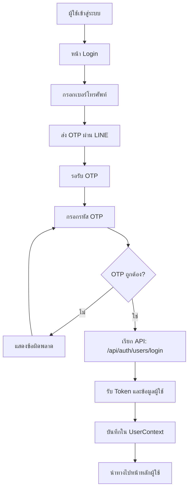
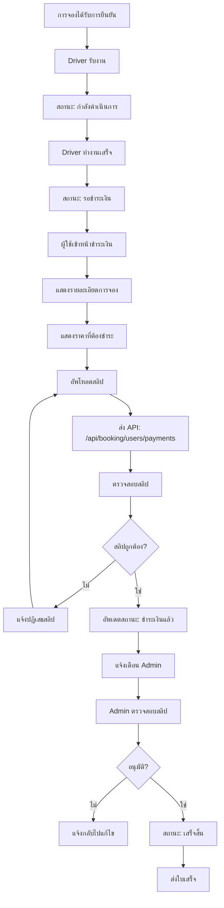
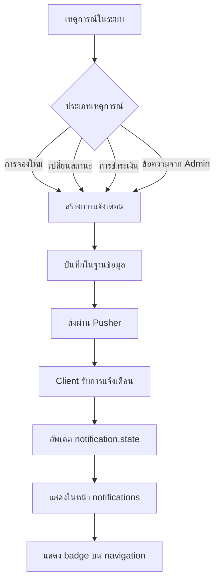

# 📋 ผังงานระบบส่วนผู้ใช้ (User System Flows)

## 🔄 1. ผังงานการลงทะเบียนผู้ใช้ (User Registration)

```mermaid
flowchart TD
    A[ผู้ใช้เข้าสู่ระบบ] --> B[เลือก "ลงทะเบียนผู้ใช้"]
    B --> C[หน้าลงทะเบียนผู้ใช้]
    C --> D[กรอกข้อมูลส่วนตัว]
    D --> E[อัพโหลดรูปโปรไฟล์]
    E --> F[ตรวจสอบข้อมูล]
    F --> G{ข้อมูลถูกต้อง?}
    G -->|ไม่| H[แสดงข้อผิดพลาด]
    H --> D
    G -->|ใช่| I[ยอมรับข้อกำหนด]
    I --> J{ยอมรับแล้ว?}
    J -->|ไม่| K[แสดง Modal ข้อกำหนด]
    K --> I
    J -->|ใช่| L[ส่งข้อมูลไปยัง API]
    L --> M[API: /api/auth/users/register]
    M --> N[บันทึกข้อมูลลงฐานข้อมูล]
    N --> O[แสดงข้อความสำเร็จ]
    O --> P[นำทางไปหน้า Login]
```

## 🔐 2. ผังงานการเข้าสู่ระบบ (User Login)



## 🏠 3. ผังงานการจองรถ (Vehicle Booking)

```mermaid
flowchart TD
    A[ผู้ใช้อยู่ในระบบ] --> B[เลือก "จองรถ"]
    B --> C[หน้าจองรถ]
    C --> D[เลือกประเภทรถ]
    D --> E[กรอกข้อมูลการจอง]
    E --> F[เลือกวันที่และเวลา]
    F --> G[เลือกจุดรับส่ง]
    G --> H[กรอกข้อมูลผู้ป่วย]
    H --> I[เลือกข้อมูลสุขภาพ]
    I --> J[คำนวณราคา]
    J --> K{ยืนยันการจอง?}
    K -->|ไม่| L[แก้ไขข้อมูล]
    L --> E
    K -->|ใช่| M[ส่ง API: /api/booking/users/comfirm-booking]
    M --> N[สร้างการจองใหม่]
    N --> O[แจ้งเตือน Driver]
    O --> P[แสดงหน้ารายการการจอง]
```

## 💳 4. ผังงานการชำระเงิน (Payment Process)



## 📋 5. ผังงานการจัดการการจอง (Booking Management)

```mermaid
flowchart TD
    A[ผู้ใช้เข้าสู่ระบบ] --> B[เลือก "รายการการจอง"]
    B --> C[หน้ารายการการจอง]
    C --> D[ดึงข้อมูล: /api/booking/users/my-bookings]
    D --> E[แสดงรายการทั้งหมด]
    E --> F[ผู้ใช้เลือกการจอง]
    F --> G{ดูรายละเอียด?}
    G -->|ใช่| H[เรียก: /api/booking/users/[id]/detail-booking]
    H --> I[แสดงรายละเอียดการจอง]
    G -->|ไม่| J{ยกเลิกการจอง?}
    J -->|ใช่| K[เรียก: /api/booking/users/[id]/cancel-booking]
    K --> L[อัพเดตสถานะ: ยกเลิก]
    L --> M[แจ้งเตือน Driver]
    J -->|ไม่| N[กลับหน้ารายการ]
```

## 🏥 6. ผังงานการจองด้านสุขภาพ (Health Booking)

```mermaid
flowchart TD
    A[ผู้ใช้เข้าสู่ระบบ] --> B[เลือก "จองด้านสุขภาพ"]
    B --> C[หน้าจองด้านสุขภาพ]
    C --> D[กรอกข้อมูลสุขภาพ]
    D --> E[วัดค่า BMI]
    E --> F[บันทึกข้อมูลสุขภาพ]
    F --> G[ส่ง API: /api/health-bookinng/create-health]
    G --> H[บันทึกข้อมูลลงฐานข้อมูล]
    H --> I[แสดงข้อความสำเร็จ]
    I --> J[นำทางไปหน้าจองรถ]
    J --> K[ใช้ข้อมูลสุขภาพในการจอง]
```

## 👤 7. ผังงานการจัดการโปรไฟล์ (Profile Management)

```mermaid
flowchart TD
    A[ผู้ใช้เข้าสู่ระบบ] --> B[เลือก "แก้ไขโปรไฟล์"]
    B --> C[หน้าแก้ไขโปรไฟล์]
    C --> D[ดึงข้อมูลผู้ใช้: /api/users]
    D --> E[แสดงข้อมูลปัจจุบัน]
    E --> F[แก้ไขข้อมูล]
    F --> G[เปลี่ยนรูปโปรไฟล์?]
    G -->|ใช่| H[อัพโหลดรูปใหม่]
    H --> I[ส่ง API: /api/user-controller/upload-image]
    G -->|ไม่| J[ส่ง API: /api/user-controller/edit-profile]
    J --> K[อัพเดตข้อมูลในฐานข้อมูล]
    K --> L[อัพเดต UserContext]
    L --> M[แสดงข้อความสำเร็จ]
```

## 🔔 8. ผังงานการแจ้งเตือน (Notification System)



## ⚙️ 9. ผังงานการตั้งค่า (Settings)

```mermaid
flowchart TD
    A[ผู้ใช้เข้าสู่ระบบ] --> B[เลือก "ตั้งค่า"]
    B --> C[หน้าตั้งค่า]
    C --> D[แสดงข้อมูลโปรไฟล์]
    D --> E[เมนูตั้งค่า]
    E --> F{เลือกตัวเลือก}
    F -->|แก้ไขโปรไฟล์| G[นำทางไปหน้าแก้ไขโปรไฟล์]
    F -->|ดูข้อกำหนด| H[แสดง Modal ข้อกำหนด]
    F -->|ออกจากระบบ| I[ยืนยันการออกจากระบบ]
    I --> J{ยืนยัน?}
    J -->|ไม่| K[กลับหน้าตั้งค่า]
    J -->|ใช่| L[เคลียร์ UserContext]
    L --> M[ลบ Token]
    M --> N[นำทางไปหน้า Login]
```

---

## 📊 สรุปผังงานทั้งหมด

### **🔐 การยืนยันตัวตน**
- ลงทะเบียนผู้ใช้ใหม่
- เข้าสู่ระบบด้วย OTP

### **🚗 การจองรถ**
- สร้างการจองใหม่
- จัดการรายการการจอง
- ยกเลิกการจอง

### **💳 การเงิน**
- ชำระเงินด้วยสลิป
- ตรวจสอบสลิปโดย Admin

### **🏥 สุขภาพ**
- บันทึกข้อมูลสุขภาพ
- ใช้ในการจองรถ

### **👤 บัญชีผู้ใช้**
- จัดการโปรไฟล์
- ตั้งค่าระบบ
- การแจ้งเตือน

---

*📋 ผังงานเหล่านี้ครอบคลุมฟังก์ชันทั้งหมดที่ผู้ใช้ต้องใช้ในระบบ DriveCare*
